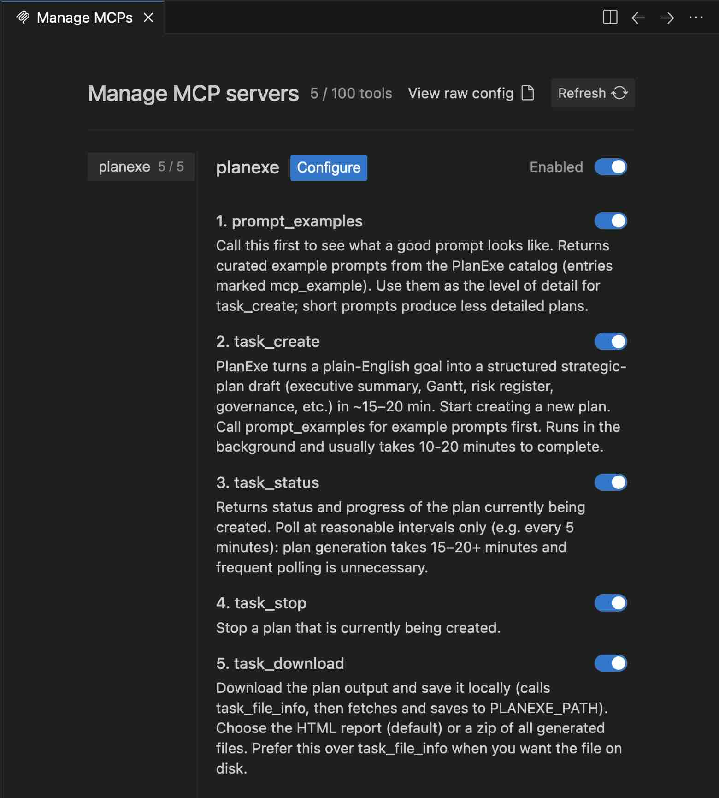

# Google Antigravity

[Antigravity](https://github.com/google-deepmind/antigravity) by Google.

[Antigravity MCP documentation](https://antigravity.google/docs/mcp)

## Interaction

My interaction history:

1. tell me about the planexe mcp tool
2. make 5 suggestions
3. crisis response plan for yellow stone outbreak, please refine that
4. I didn't meant outbreak, I meant vulcanic
5. your prompt is a bit shorter than the example prompts
6. go ahead create the plan
7. stop that plan you are creating.
8. now create the plan again, this time with ALL details. Last time you had FAST selected that would leave out most details.
9. check status
10. status
11. status
12. status
13. download the report
14. summarize the report
15. does it correspond to your expectations?

I had to manually ask about `check status` to get details how the plan creation was going. It's not something that Antigravity can do.

The created plan is here: [Yellowstone Evacuation](https://planexe.org/20260201_yellowstone_evacuation_report.html)


## Prerequisites

A working installation of PlanExe.

- The recommended way is to install PlanExe by following the [Getting Started](../getting_started.md) instructions.
  Make sure that `docker compose up` is running, in order to connect to PlanExe.
- Alternatively: Run PlanExe on another server and port.
- Alternatively: If you are a developer run PlanExe inside a python virtual environment.

Double check that PlanExe can take a prompt and create a plan. Since it doesn't make sense to start configuring Antigravity if the PlanExe installation is incomplete.

## Configuring Antigravity

To configure Antigravity to use PlanExe, you need to add the MCP server configuration.

1. Open Antigravity
2. Click the "..." icon at the top of the Agent panel
3. Select "MCP Servers"
4. This opens the `mcp_config.json` file.

Add the following `planexe` dictionary to your `mcpServers` configuration:

```json
{
  "mcpServers": {
    "planexe": {
      "command": "uv",
      "args": [
        "run",
        "--with",
        "mcp",
        "/path/to/PlanExe/mcp_local/planexe_mcp_local.py"
      ],
      "env": {
        "PLANEXE_URL": "http://localhost:8001/mcp",
        "PLANEXE_PATH": "/Users/your-name/Desktop"
      }
    }
  }
}
```

Make these adjustments to the `planexe` snippet:

- Make adjustments to `/path/to/PlanExe` so it points to where PlanExe is located on your computer.
- Make adjustments to `/Users/your-name/Desktop` so it points to the directory where PlanExe is allowed to write to, so the plan can be downloaded.
- Optional: Make adjustments to `http://localhost:8001/mcp` if you have PlanExe running on another port.

Once you have saved the `mcp_config.json`. Then go to the `Manage MCP Servers` and click the refresh icon.

If it doesn't work then ask on the [PlanExe Discord](https://planexe.org/discord) for help.

This is what it should look like:

