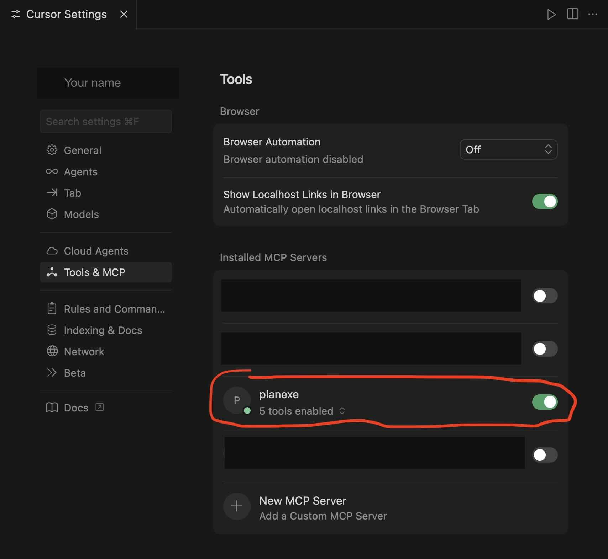

# Cursor

According to [Cursor's wikipedia page](https://en.wikipedia.org/wiki/Cursor_(code_editor)):

> Several media outlets have described Cursor as a vibe coding app.

And

> Cursor allows developers produce code from natural language instructions.

## Prerequisites

- Cursor installed.
- PlanExe MCP server reachable by Cursor.

## Quick setup

1. Configure MCP in Cursor.
2. Ask for prompt examples.
3. Create a plan task and download the report.

## Sample prompt

> Get example prompts for creating a plan.

## Success criteria

- You can fetch prompt examples.
- You can create a plan task.
- You can download the report.

## Video

**Video (1m29s)** - PlanExe inside Cursor

Here I'm chatting with Cursor. Behind the scenes Cursor talks with PlanExe via MCP.

In total it takes 18 minutes to create the plan. The boring parts have been cropped out.

<iframe width="560" height="315" src="https://www.youtube.com/embed/rVsH_iUZayA?si=VJz4uYnxyob4zYp_" title="YouTube video player" frameborder="0" allow="accelerometer; autoplay; clipboard-write; encrypted-media; gyroscope; picture-in-picture; web-share" referrerpolicy="strict-origin-when-cross-origin" allowfullscreen></iframe>

## Interaction

My interaction with Cursor for creating a plan is like this:

1. tell me about the planexe mcp tool you have access to
2. I want you to come up with a good prompt
3. I want something ala winter olympics in Italy 2026
4. Slightly different idea. I want Denmark to switch from DKK to EUR. Use the persona of a person representing Denmark's ministers.
5. go ahead create plan with all details
6. *wait for 18 minutes until the plan has been created*
7. download the plan

Here is the created plan: [DKK to EUR](https://planexe.org/20260129_euro_adoption_report.html)

## Prerequisites

A working installation of PlanExe.

- The recommended way is to install PlanExe by following the [Getting Started](../getting_started.md) instructions.
  Make sure that `docker compose up` is running, in order to connect to PlanExe.
- Alternatively: Run PlanExe on another server and port.
- Alternatively: If you are a developer run PlanExe inside a python virtual environment.

Double check that PlanExe can take a prompt and create a plan. Since it doesn't make sense to start configuring Cursor if the PlanExe installation is incomplete.


## Configuring Cursor

Go to `Cursor Settings` → `Tools & MCP`

Click `New MCP Server`, which opens `.cursor/mcp.json`

Insert the following `planexe` dictionary inside the `mcpServers` dictionary. 

```json
{
  "mcpServers": {
    "planexe": {
      "command": "uv",
      "args": [
        "run",
        "--with",
        "mcp",
        "/path/to/PlanExe/mcp_local/planexe_mcp_local.py"
      ],
      "env": {
        "PLANEXE_URL": "http://localhost:8001/mcp",
        "PLANEXE_PATH": "/Users/your-name/Desktop"
      }
    }
  }
}
```

Make these adjustments to the `planexe` snippet.

- Make adjustments to `/path/to/PlanExe` so it points to where PlanExe is located on your computer.
- Make adjustments to `/Users/your-name/Desktop` so it points to the directory where PlanExe is allowed to write to, so the plan can be downloaded.
- Optional: Make adjustments to `http://localhost:8001/mcp` if you have PlanExe running on another port.

Now Cursor is connected with PlanExe, and it looks like this.
If it doesn't then ask on the [PlanExe Discord](https://planexe.org/discord) for help.


