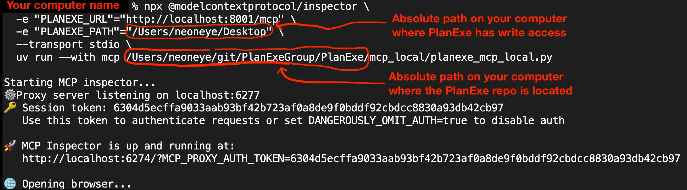
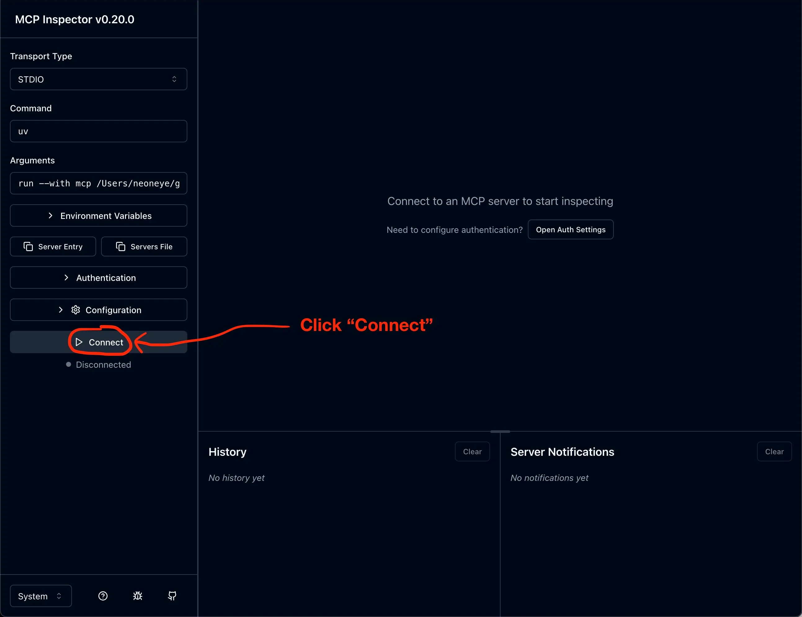
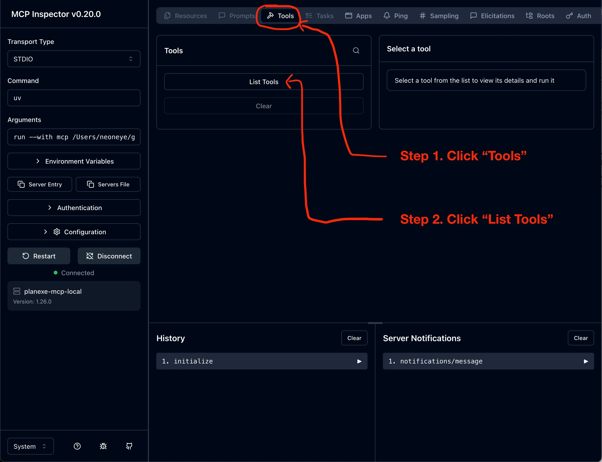
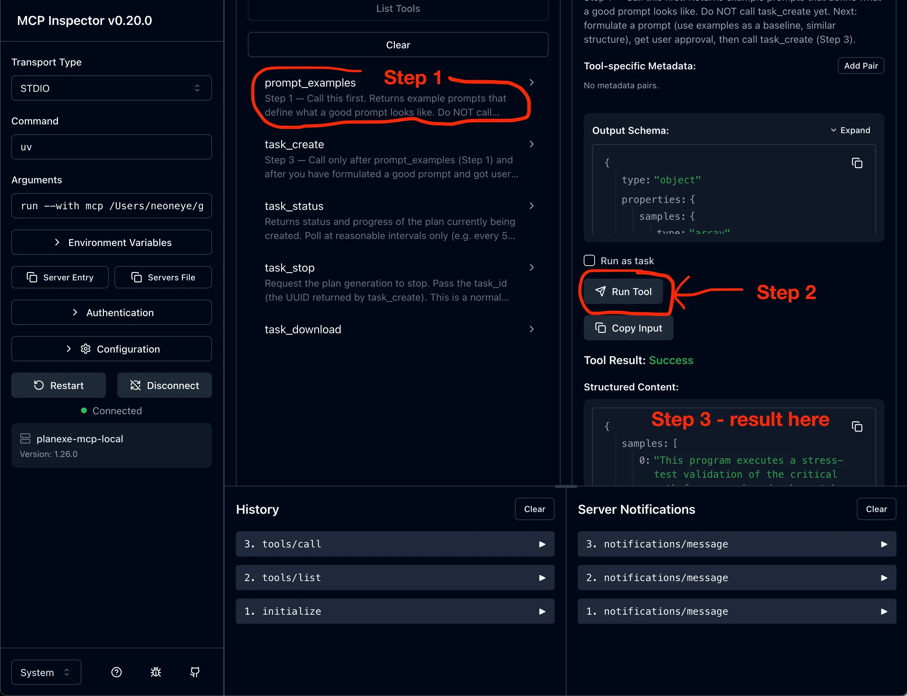

# Inspector

Inspecting PlanExe's MCP server. 

This is my (Simon Strandgaard) preferred way to troubleshoot MCP. Whenever there is a problem with MCP, the **inspector** is the **HAMMER**.

Locations: [Github](https://github.com/modelcontextprotocol/inspector), [Documentation](https://modelcontextprotocol.io/docs/tools/inspector)

## Overview of PlanExe's MCP servers

PlanExe has multiple MCP servers that can be connected to.

|#|Difficulty|Description|
|-|----------|-----------|
| 1 | Beginner | MCP server at [mcp.planexe.org/](https://mcp.planexe.org/) and cost credits to use. Manage your credits via this page: [home.planexe.org](https://home.planexe.org) |
| 2 | Medium | MCP server inside docker on your own computer. |
| 3 | Expert | MCP server as a python program on your own computer. |

## Approach 1. MCP server at mcp.planexe.org

### Purchase credits

1. Open [home.planexe.org](https://home.planexe.org)
2. Sign in with Google
3. Buy credits for 1 USD.
4. Click `Generate new API key` and copy it to clipboard. You will need this API key, in order to connect to the server.

### Connect to MCP Server

```bash
npx @modelcontextprotocol/inspector --transport http --server-url https://mcp.planexe.org/mcp/
```

This opens the inspector in a browser


In the left sidebar; Expand the `Authentication` section.


This is what the custom headers should look:


**Do not use OAuth** – PlanExe uses API keys, not OAuth. The OAuth flow will fail with "Failed to discover OAuth metadata".

1. Use **Custom Headers** instead: click `+ Add` inside the Custom Headers section.
2. In `Header Name`, insert `X-API-Key`.
3. In `Header Value`, insert your API key (e.g. `pex_...`).
4. Click **Connect**.


If `Connect` fails with this error: *"Connection Error - Check if your MCP server is running and proxy token is correct"*. This can happen if the `Authentication` section has incorrect data, so double check for typos.

If `Connect` fails with this error: *Connection Failed: "TypeError: NetworkError when attempting to fetch resource."*. This can happen if the `Authentication` section has incorrect data, so double check for typos.

If `Connect` still fails, then please report your issue on [Discord](https://planexe.org/discord). 

### When connected

When connected follow these steps:

1. In the topbar; Click on the `Tools` tab.
2. In the `Tools` panel; Click on the `List Tools` button.


Now there should be a list with tool names and descriptions:
```
prompt_examples
task_create
task_status
task_stop
task_file_info
```

Follow these steps:


1. In the `Tools` panel; Click on the `prompt_examples` tool.
2. In the `prompt_examples` right sidepanel; Click on `Run Tool`. 
3. The MCP server should respond with a list of list of example prompts.

## Approach 2. MCP server inside docker

### Prerequisites

I assume you are able to create plans on your computer via the `frontend_single_user` web interface, [http://localhost:7860/](http://localhost:7860/). It doesn't make sense proceeding if there is a problem with LLMs and no plan can be created.

### Start docker

PlanExe's docker stack exposes the MCP endpoint on your loopback interface (default `127.0.0.1:8001/mcp/`). Start with `docker compose up` and wait until you see `mcp_cloud` and `/healthcheck` like this:
```
mcp_cloud | INFO: 127.0.0.1:43988 - "GET /healthcheck HTTP/1.1" 200 OK
```

### Start inspector

In a separate terminal; launch the inspector.

```bash
npx @modelcontextprotocol/inspector --transport http --server-url http://localhost:8001/mcp/
```


Once the UI opens in the browser, keep `Authentication` empty and click `Connect`.


### When connected

Then open the `Tools` tab, click `List Tools`.


Click `prompt_examples`, click `Run Tool`.


## Approach 3. MCP server as a python program

If MCP had a built-in download mechanism, then there wouldn't be a need for this python program. As of 2026-Feb-12 MCP doesn't have such download mechanism, and developers make kludgy workarounds. The `mcp_local/planexe_mcp_local.py` proxy runs a tiny Python MCP server that forwards tool calls to the remote `mcp_cloud` while downloading reports into a local directory.

### Prerequisites

I assume that you already have verified that things are working in "Approach 2. MCP server inside docker". If things are broken there, it makes no sense following the instructions here.

### Start docker

PlanExe's docker stack exposes the MCP endpoint on your loopback interface (default `127.0.0.1:8001/mcp/`). Start with `docker compose up` and wait until you see `mcp_cloud` and `/healthcheck` like this:
```
mcp_cloud | INFO: 127.0.0.1:43988 - "GET /healthcheck HTTP/1.1" 200 OK
```

### Start inspector

In a separate terminal; launch the inspector.

On my computer, I launch the inspector like this:



You have to make these adjustments for your computer.

The `PLANEXE_PATH` is an absolute directory that PlanExe is allowed to write to. The downloaded files lands here.

The `/absolute/path/to/PlanExe` is where you have cloned the PlanExe repo.

```bash
npx @modelcontextprotocol/inspector \
  -e "PLANEXE_URL=http://localhost:8001/mcp" \
  -e "PLANEXE_PATH=/absolute/path/for/downloads" \
  --transport stdio \
  uv run --with mcp /absolute/path/to/PlanExe/mcp_local/planexe_mcp_local.py
```

Once the UI opens in the browser, click `Connect`.



### When connected

Then open the `Tools` tab, click `List Tools`.



Click `prompt_examples`, click `Run Tool`.


