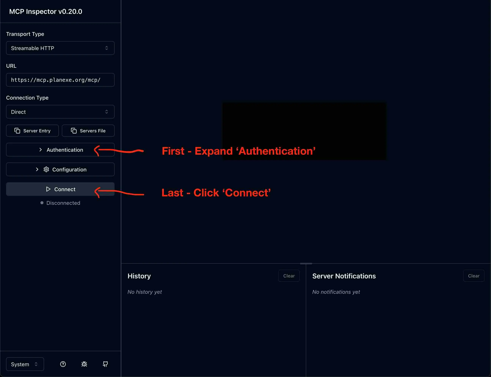
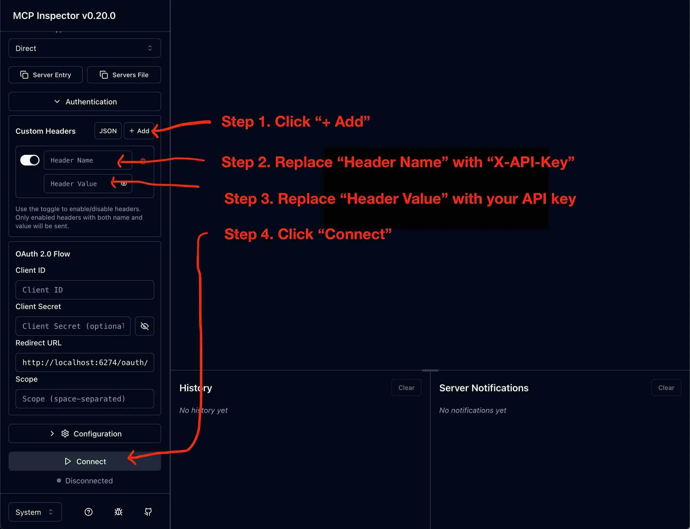
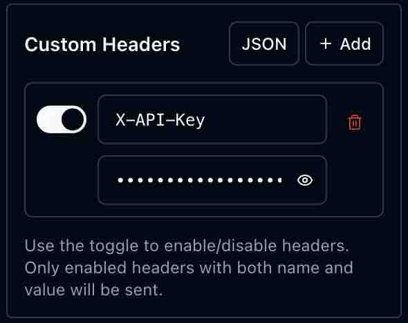
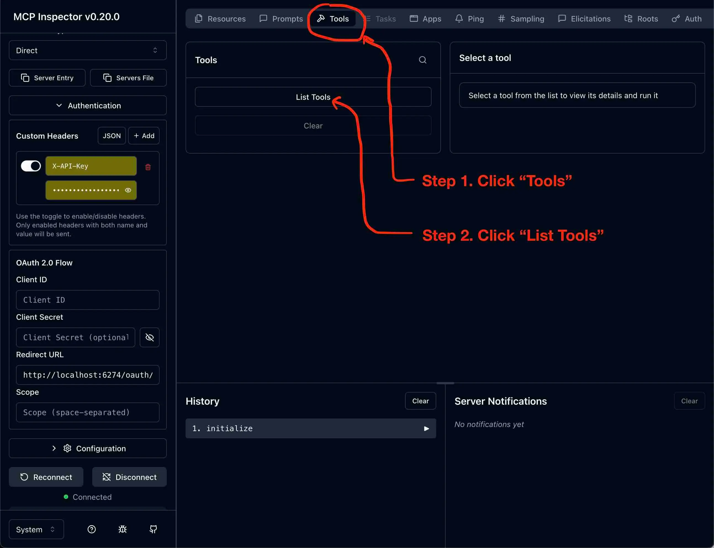
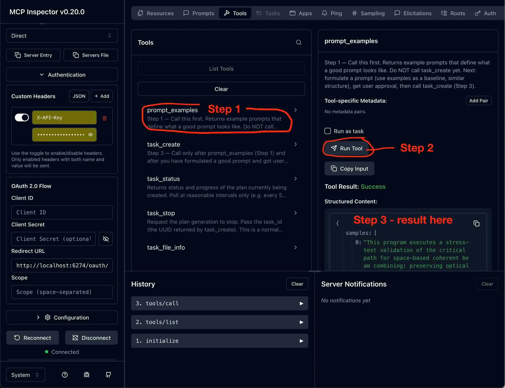
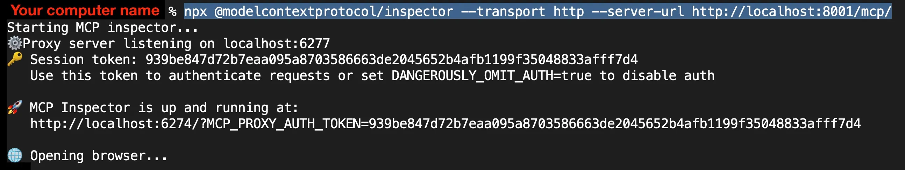
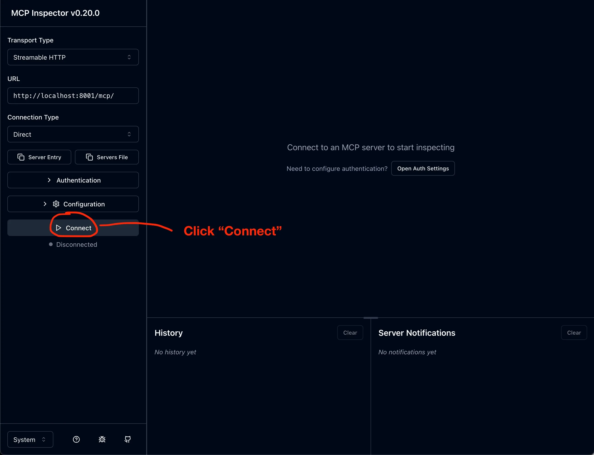
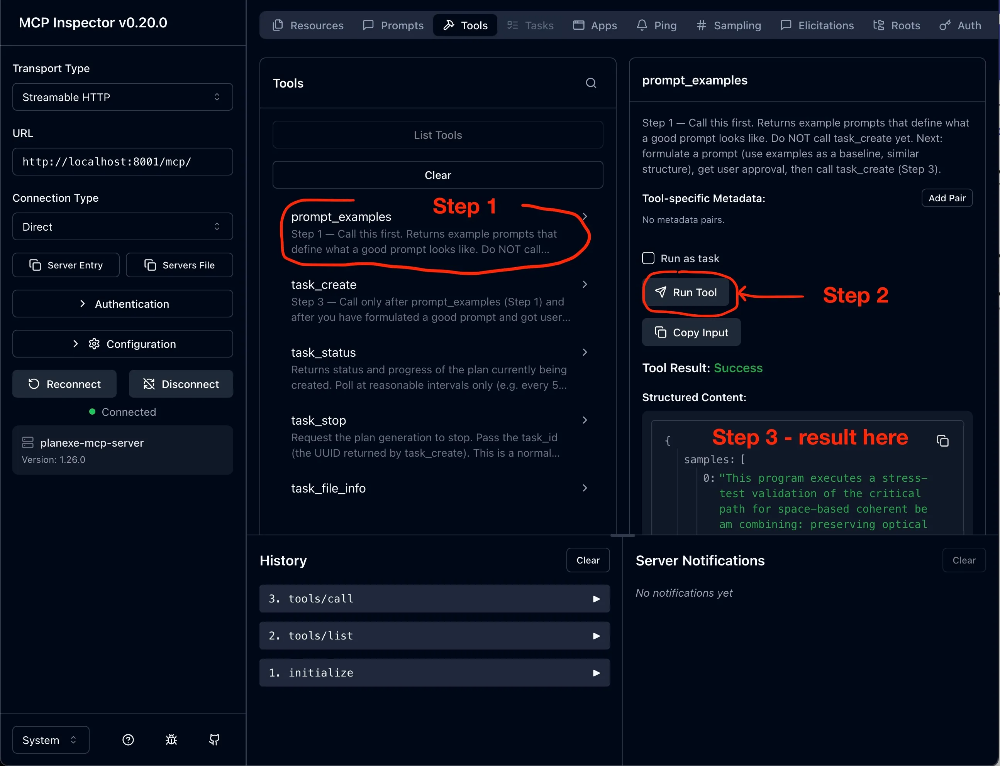

# Inspector

Inspecting PlanExe's MCP server. 

This is my (Simon Strandgaard) preferred way to troubleshoot MCP. Whenever there is a problem with MCP, the **inspector** is the **HAMMER**.

Locations: [Github](https://github.com/modelcontextprotocol/inspector), [Documentation](https://modelcontextprotocol.io/docs/tools/inspector)

## Overview of PlanExe's MCP servers

PlanExe has multiple MCP servers that can be connected to.

|#|Difficulty|Description|
|-|----------|-----------|
| 1 | Beginner | MCP server at [mcp.planexe.org/](https://mcp.planexe.org/) and cost credits to use. Manage your credits via this page: [home.planexe.org](https://home.planexe.org) |
| 2 | Medium | MCP server inside docker on your own computer. |
| 3 | Expert | MCP server as a python program on your own computer. |

## Approach 1. MCP server at mcp.planexe.org

### Purchase credits

1. Open [home.planexe.org](https://home.planexe.org)
2. Sign in with Google
3. Buy credits for 1 USD.
4. Click `Generate new API key` and copy it to clipboard. You will need this API key, in order to connect to the server.

### Connect to MCP Server

```bash
npx @modelcontextprotocol/inspector --transport http --server-url https://mcp.planexe.org/mcp/
```

This opens the inspector in a browser



In the left sidebar; Expand the `Authentication` section.



This is what the custom headers should look:


**Do not use OAuth** – PlanExe uses API keys, not OAuth. The OAuth flow will fail with "Failed to discover OAuth metadata".

1. Use **Custom Headers** instead: click `+ Add` inside the Custom Headers section.
2. In `Header Name`, insert `X-API-Key`.
3. In `Header Value`, insert your API key (e.g. `pex_...`).
4. Click **Connect**.


If `Connect` fails with this error: *"Connection Error - Check if your MCP server is running and proxy token is correct"*. This can happen if the `Authentication` section has incorrect data, so double check for typos.

If `Connect` fails with this error: *Connection Failed: "TypeError: NetworkError when attempting to fetch resource."*. This can happen if the `Authentication` section has incorrect data, so double check for typos.

If `Connect` still fails, then please report your issue on [Discord](https://planexe.org/discord). 

When connected follow these steps:


1. In the topbar; Click on the `Tools` tab.
2. In the `Tools` panel; Click on the `List Tools` button.

Now there should be a list with tool names and descriptions:
```
prompt_examples
task_create
task_status
task_stop
task_file_info
```

Follow these steps:


1. In the `Tools` panel; Click on the `prompt_examples` tool.
2. In the `prompt_examples` right sidepanel; Click on `Run Tool`. 
3. The MCP server should respond with a list of list of example prompts.

## Approach 2. MCP server inside docker

PlanExe's docker stack exposes the MCP endpoint on your loopback interface (default `127.0.0.1:8001/mcp/`). Start with `docker compose up` and wait until you see `mcp_cloud` and `/healthcheck` like this:
```
mcp_cloud | INFO: 127.0.0.1:43988 - "GET /healthcheck HTTP/1.1" 200 OK
```

In a separate terminal; launch the inspector.

```bash
npx @modelcontextprotocol/inspector --transport http --server-url http://localhost:8001/mcp/
```



Once the UI opens in the browser, keep `Authentication` empty and click `Connect`.



Then open the `Tools` tab, click `List Tools`.


Click `prompt_examples`, click `Run Tool`.




## Approach 3. MCP server as a python program

The `mcp_local/planexe_mcp_local.py` proxy runs a tiny Python MCP server that forwards tool calls to the remote `mcp_cloud` while downloading reports into a local directory. It is handy when you want Inspector to speak to MCP over stdio or need the downloads saved directly on your workstation.

Set these environment variables before running the inspector:

- `PLANEXE_URL`: where the proxy should forward the tool calls, usually `http://localhost:8001/mcp` if you are running the docker stack locally.
- `PLANEXE_MCP_API_KEY`: optional. Only needed if Approach 2 has auth enabled (`PLANEXE_MCP_REQUIRE_AUTH=true`).
- `PLANEXE_PATH`: an absolute directory that PlanExe is allowed to write to (downloads land here).

Then launch Inspector like this:

```bash
npx @modelcontextprotocol/inspector \
  -e "PLANEXE_URL=http://localhost:8001/mcp" \
  -e "PLANEXE_MCP_API_KEY=insert-your-api-key-here" \
  -e "PLANEXE_PATH=/absolute/path/for/downloads" \
  --transport stdio \
  uv run --with mcp /absolute/path/to/PlanExe/mcp_local/planexe_mcp_local.py
```

The `uv run --with mcp` invocation starts the proxy via the uvicorn entry point that ships with the repo. If Approach 2 auth is disabled, `PLANEXE_MCP_API_KEY` can be omitted. If auth is enabled, the script injects the API key for you, so you normally do not need to add another `X-API-Key` header in the Authentication tab. After connecting, the Tools list now includes the synthetic `task_download` helper in addition to `prompt_examples`, `task_create`, `task_status`, and friends; the rest of the workflow is identical to Approach 1. Do **not** enable "Run as task"—PlanExe uses the tool-based flow (`create` → `status` → `download`) exclusively.
