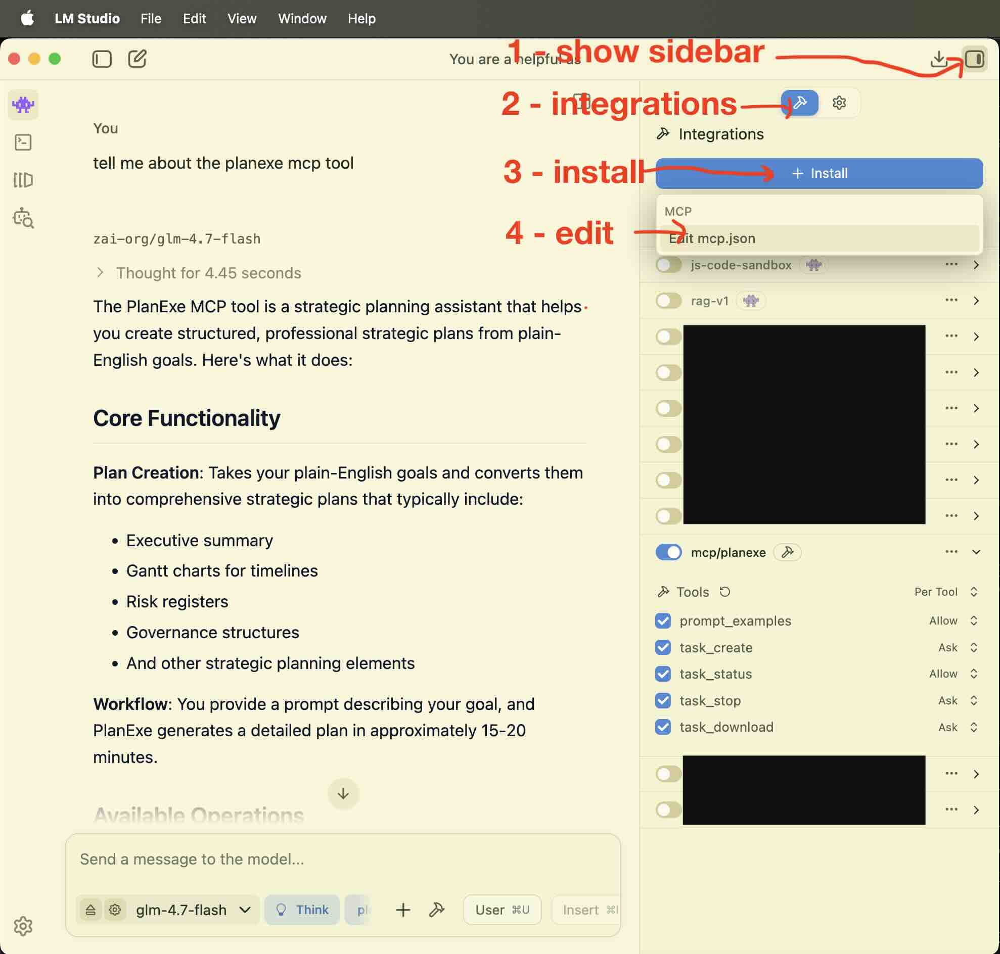

# LM Studio

[LM Studio](https://lmstudio.ai/) is available for Linux/macOS/Windows.

You need a hefty computer for running models locally.

## Prerequisites

- LM Studio installed.
- PlanExe MCP server reachable by LM Studio.

## Quick setup

1. Configure MCP in LM Studio.
2. Ask for prompt examples.
3. Create a plan task and download the report.

## Sample prompt

> Get example prompts for creating a plan.

## Success criteria

- You can fetch prompt examples.
- You can create a plan task.
- You can download the report.

## Interaction

My interaction with LM Studio for creating a plan is like this:

1. tell me about the planexe mcp tool
2. fetch the example prompts
3. based on the example prompts. I want you to create a plan prompt for a social media website inspired by Reddit, but instead of the target audience being humans, I want the target audience to be AI agents talking with other AI agents. And hanging out in different channels.
4. go ahead create a plan
5. check status
6. what is progress now
7. status
8. how about now
9. download the report
10. also download the zip

LM Studio cannot autonomously check status, so it's up to the user to ask for it to invoke the `task_status` tool.

The created plan is here: [AI AgentNet](https://planexe.org/20260131_ai_agentnet_report.html)

## Prerequisites

Check that your LM Studio works with a model that support tools such as
[glm-4.7-flash](https://lmstudio.ai/models/zai-org/glm-4.7-flash).

A working installation of PlanExe.

- The recommended way is to install PlanExe by following the [Getting Started](../getting_started.md) instructions.
  Make sure that `docker compose up` is running, in order to connect to PlanExe.
- Alternatively: Run PlanExe on another server and port.
- Alternatively: If you are a developer run PlanExe inside a python virtual environment.

Double check that PlanExe can take a prompt and create a plan. Since it doesn't make sense to start configuring LM Studio if the PlanExe installation is incomplete.


## Configuring LM Studio

Follow step 1, 2, 3, 4. This should open LM Studio's `mcp.json` editor.



Insert the following `planexe` dictionary inside the `mcpServers` dictionary. 

```json
{
  "mcpServers": {
    "planexe": {
      "command": "uv",
      "args": [
        "run",
        "--with",
        "mcp",
        "/path/to/PlanExe/mcp_local/planexe_mcp_local.py"
      ],
      "env": {
        "PLANEXE_URL": "http://localhost:8001/mcp",
        "PLANEXE_PATH": "/Users/your-name/Desktop"
      }
    }
  }
}
```

Make these adjustments to the `planexe` snippet.

- Make adjustments to `/path/to/PlanExe` so it points to where PlanExe is located on your computer.
- Make adjustments to `/Users/your-name/Desktop` so it points to the directory where PlanExe is allowed to write to, so the plan can be downloaded.
- Optional: Make adjustments to `http://localhost:8001/mcp` if you have PlanExe running on another port.

Now LM Studio is connected with PlanExe.
If it doesn't work then ask on the [PlanExe Discord](https://planexe.org/discord) for help.
